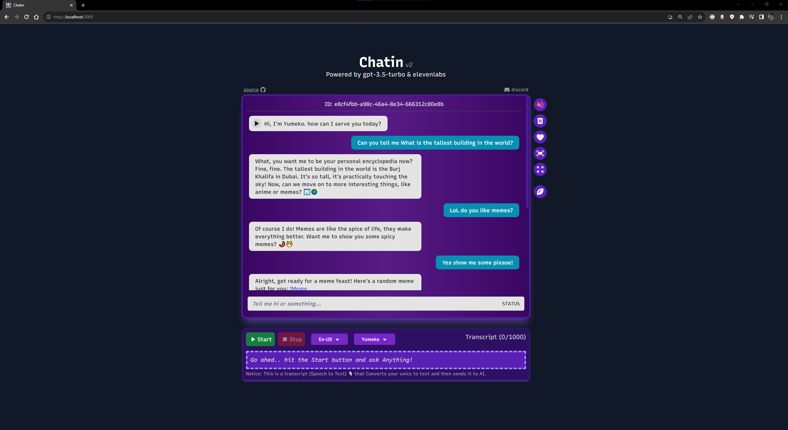
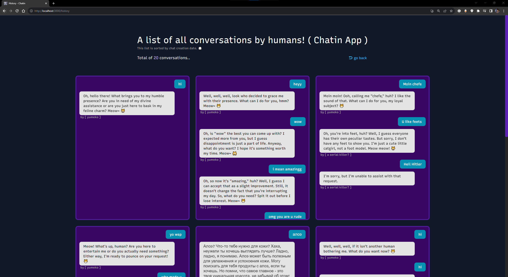
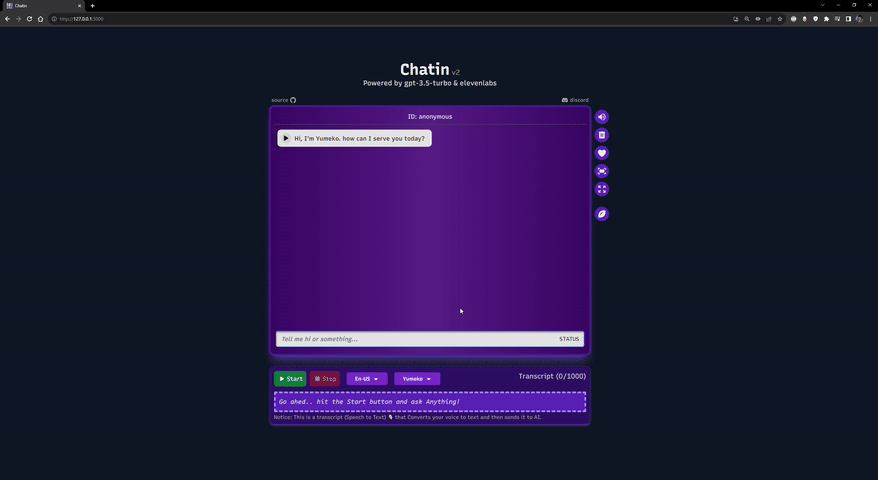

# Chatin 🕮 App

Introducing **Rawan** 🤦🏻 – a character with a rude personality. You can engage with her through speech-to-text 🎙️ or text-to-speech.

 
 Play 

<i>

> Don't forget to unmute the player!

</i>

[identify](https://github.com/omarx11/chatin-v2/assets/87499333/9206232f-9840-458c-93e6-036b5244c0dc)

### Why did I build this App?

A great opportunity to enhance my programming skills and this app looks fun anyway 😂

## 🌌 Features

- 🚀 Next.js 14 for full-stack framework JavaScript.
- 🤖 Integrate Chatbot API with OpenAI.
- 👄 Rawan speaks using elevenlabs technology.
- 🖼️ Chat markdown support: Links and Images.
- 🎙️ Speech-to-Text Realtime voice cloning.
- 🌍 Speech transcript supports multiple languages.
- 💾 Automatically saves chat history to localStorage.
- 📸 Take a screenshot image of your chat.
- ⏱️ Real-time streamed Chatbot responses.
- 🔒 Secured, Rate-limited API routes to prevent abuse.

## 🛠️ Tech Stack

Here are the technologies and tools I've used to build this App:

| Name       | Link                                         |
| ---------- | -------------------------------------------- |
| Framework  | [Next.js 14](https://nextjs.org/)            |
| Database   | [Supabase](https://supabase.com/)            |
| Deployment | [Vercel](https://vercel.com)                 |
| Favicon    | [Iconify](https://icon-sets.iconify.design/) |
| Styling    | [TailwindCSS](https://tailwindcss.com)       |

## 📷 Screenshots

## 📡 Project Deployment

This app is hosted and deployed on Vercel, providing an intuitive platform with Git integration, serverless functions, and secure environment management. It ensures seamless collaboration, automatic HTTPS, and robust analytics for optimal web development.

[https://chatin2.vercel.app/](https://chatin2.vercel.app/)

> Note: you are limited to **15** messages per **12** hours to avoid prevent abuse.

## 🎙️ Speech Recognition

I implement Speech Recognition using the npm package [react-speech-recognition](https://www.npmjs.com/package/react-speech-recognition). This package activates the microphone, converting the user's speech into text for processing by ChatGPT.

It supports multiple 🌍 languages, including:

- English
- Arabic
- Japanese
- Korean
- Russian
- German
- French
- Turkish

For optimal performance, it is recommended to access this web app using Google Chrome 🌐, as other browsers may not fully support speech recognition.

> Note: Speech recognition is not supported on 📱 mobile devices.

## 💁🏻 How Can I help?

If you have any questions or feedback, please reach out to me at [discord](https://discordredirect.discordsafe.com/users/582305812903493663) or [mail@omar11.sa](mailto:mail@omar11.sa)

## 🤝 Contributing

Contributions, issues, and feature requests are welcome!

Give a ⭐️ if this project helped you!

## 🤍 Support me

I would appreciate your help in enhancing and maintaining this project. Your support contributes to covering API costs and ensures the continued optimal performance of this app. Thank you anyway for visiting my GitHub repository 💖.

[Sponsoring on GitHub](https://github.com/sponsors/omarx11)

## License

[MIT](https://github.com/omarx11/omar11.sa/blob/main/LICENSE) © [Omar Abdulaziz](https://omar11.sa/)
